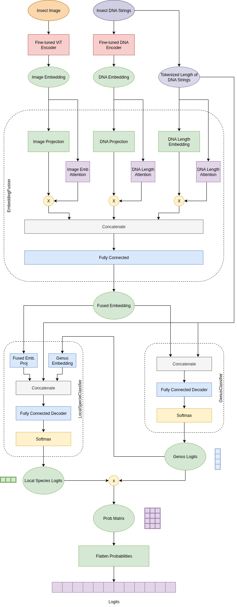

# Hierarchical Insect Classification via DNA–Image Fusion  

This repository contains the implementation of my **Deep Learning course project** on multimodal insect classification. The goal is to classify insect species by combining **DNA sequences** and **images**, using a **hierarchical model** that first predicts the **genus** and then identifies the **species** within that genus.

Full project report: [DL_Project_Insect_Classification.pdf](./DL_Project_Insect_Classification.pdf)  
Codebase: implemented in **PyTorch**, **Hugging Face Transformers**  
Fine-tuned models available on Hugging Face:  
- [ViT Insect Classifier](https://huggingface.co/amintehrani/vit-insects-finetuned7)  
- [DNA Encoder](https://huggingface.co/amintehrani/dnaencoder-insects-finetuned)  


---
## Model Overview
<div align="center">
    
</div>
---

## Dataset
You can download the dataset from here: [Dataset](https://mega.nz/file/UVYH1TYA#XBhKVsXh_-3wWPCM_PR71xKVAsLpaxm__LnHYkueBGA)  
(In order to run the project, create a link to the dataset in `./insect_dataset.mat`)

- **Size**: 32,424 paired DNA–image samples.  
- **Labels**: 1050 species, grouped into 372 genera.  
- **Splits**:  
  - Train: 13,039  
  - Validation (seen/unseen): 6,955  
  - Test (seen/unseen): 12,430  
- **Images**: RGB, shape (3×64×64).  
- **DNA sequences**: up to 1551 nucleotides. padded to 1551


## Code Structure
- `vit.py` → Fine-tune or evaluate Vision Transformer on insect images. 
- `dnaencoder.py` → Fine-tune Nucleotide Transformer on DNA sequences.

- `train.py` → Train multimodal classifier with DNA & image embeddings.

- `models.py` → Fusion module + hierarchical classification architecture.  
- `multimodal_dataset.py` → Dataset loader (DNA + Image).  
- `load_embeddings.py` → Precompute and load DNA/image embeddings.  
- `mat.py` → Loads `insect_dataset.mat`.  

---

## Usage

### 1. Setup
```bash
git clone https://github.com/amin-tehrani/insect-classification-deeplearning
cd insect-classification-deeplearning
pip install -r requirements.txt
```

### 2. Download the dataset
```bash
# Download the dataset
wget <dataset_url> -O ./insect_dataset.mat
```


### 3. Unimodal encoders
#### Option 1: Fine-tuning
```bash
# DNA encoder
python dnaencoder.py finetune

# Vision Transformer
python vit.py finetune
```
#### Option 2: Pull them from Hugging Face
```python
import vit, dnaencoder
vit_processor, vit_embedder = get_processor_encoder("amintehrani/vit-insects-finetuned7")
dna_processor, dna_embedder = get_tokenizer_encoder("amintehrani/dnaencoder-insects-finetuned")
```

### 4. Prepare Embeddings
#### Option 1: Compute embeddings
```bash
python load_embeddings.py <device> <output_dir> <B: Batch size>
# python load_embeddings.py cuda:0 ./output_embeddings 128
```
#### Option 2: Use precomputed embeddings
```python
from load_embeddings import load_dna_embeddings, load_img_embeddings
all_dna_features = load_dna_embeddings()
all_image_features = load_img_embeddings()
```

### 5. Train multimodal classifier
Before training, ensure the training args are what you want in the last line of `train.py`.
```bash
python train.py
# or preferably use torch.distributed.launch for distributed training
python -m torch.distributed.run --nproc_per_node=4 train.py
```

### 6. Evaluate the model
For this run the `evaluate.ipynb` notebook.